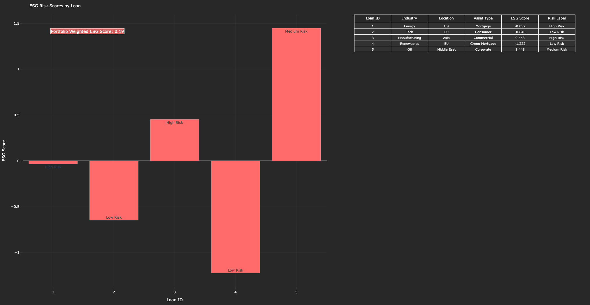

# esg_risk_scoring_model_for_loans

- This Python tool assigns Environmental, Social, and Governance (ESG) risk scores to loans and integrates them into portfolio-level ESG reporting.
- It visualizes individual loan ESG scores alongside a portfolio-weighted ESG metric.

---

## Files
- `esg_risk_scoring.py`: Main script for processing loan data, calculating weighted ESG scores, and generating a Plotly visualization.
- `output.png`:Plot.

---

## Libraries Used
- `pandas`
- `plotly`

---

## Features
- **Input**: Uses predefined loan data with factors like industry, location, asset type, ESG scores, and risk labels.
- **Portfolio Weighting**: Calculates loan weights based on loan amounts and computes a portfolio-level weighted ESG score.
- **Visualization**: Creates a dual-view Plotly plot:
  - Bar chart of ESG scores by loan ID with risk labels.
  - Table summarizing loan details (ID, industry, location, asset type, ESG score, risk label).
- **Metrics**: Displays the portfolio-weighted ESG score as an annotation.

## Screenshots

